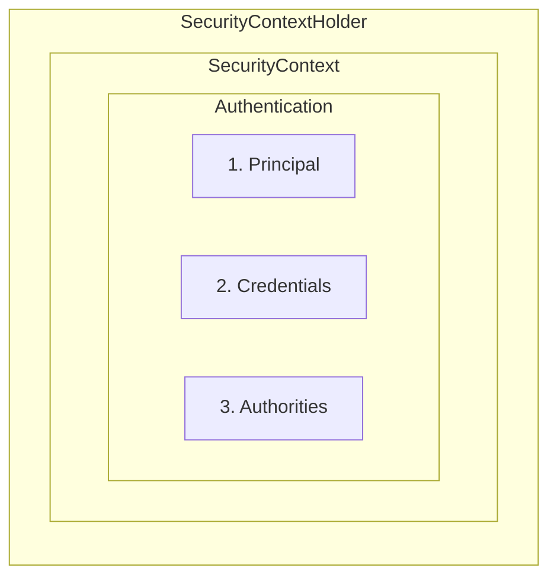

# The Big Picture

A larger view of what is happening in spring security. You'll learn about spring security filter chain, no of authentication components
that are common to working with spring security. 

## The filter chain

The spring security filter chain is a set of security filters that are run in a sequence on each request. 


Each filter can short-circuit the request and prevent the other filters 
and servlets from running. This carries some nice security benefits:
* Each filter can focus on its area of security expertise
* No filter needs to worry about downstream filters running if it rejects the request

Generally speaking, filter chain filters can be separated into 4 categories:
* [Defense filters](#defense-filters)
* [Authentication filters](#authentication-filters)
* [Authorization filters](#authorization-filters)
* [Infrastructural filters](#infrastructural-filters)

### Defense Filters
Before authentication is attempted, spring security defends the application against malicious requests. These filters include:

* **CSRFFilter** - the filter that checks incoming CSRF tokens and issues new ones
* **HeaderFilter** - the filter that writes secure headers to the HTTP response

Other than certain infrastructural filters, defence filters are the first filters in the filter chain

### Authentication filters

Once the request is determined to be safe, the filter chain moves on to the authenticating the request.

Each authentication filter handles a single authentication scheme. You'll already know a few.

* **BasicAuthenticationFilter** - Handles HTTP Basic authentication
* **BearerTokenAuthenticationFilter** - Handles Bearer token authentication (including JWTs)
* **UsernamePasswordAuthenticationFilter** - Handles Form login authentication
* **AnonymousAuthenticationFilter** - Populates the context with a Null Object authentication instance.

While not uniform, each authentication filter uses roughly the similar *pseudocode*

```java
// Note: this is pseudocode!
if (!requestMatcher.matches(request)) {
  // skip this filter
} else {
  Authentication token = getAuthenticationRequest(request) <1>
  try {
    Authentication result = authenticationManager.authenticate(token) <2> <3>
    saveToSecurityContextHolder(result);
    fireSuccessEvent(result);
    handleSuccess(result);
  } catch (AuthenticationException ex) {
    handleFailure(token);
  }
}

```
1. <1> parses the request material into a credential
2. <2> tests the credential and returns a principal and authorities
3. <3> constructs the principal and authorities

#### Authentication

`Authentication` is a spring security interface that represents both an authentication token and an authentication result.

Each authentication instance contains different values, depending upon whether it's a token or a result. 

| Authentication Token  | Authentication Result      |
|-----------------------|----------------------------|
| principal("who")      | principal("who")           |
| credential("proof")   | credential("proof")        |
| authenticated = false | authenticated = true       |
|                       | authorities("permissions") |

> **Note**: In some cases, like username and password authentication, the authentication result does not contain the user's password for security reasons.

As you can see in pseudo-code above:
* If the authentication fails, the *authenticationManager* throws an exception
* If the *authenticationManager* returns an *Authentication, then the authentication **Succeeded**

#### AuthenticationManager

`AuthenticationManager` is an interface that tests an authentication token. If the test succeeds, then the 
`AuthenticationManager` constructs an authentication result.

The `AuthenticationManager` is composed of several `AuthenticationProviders`, each of which handle a single authentication scheme, like authenticating a JWT. 

#### Security Context

The `SecurityContext` is an object that holds the current `Authentication`



The reason for `SecurityContext` is so that the application can hold additional security information other than the current user, if they want to;
However, this is the feature that is very rarely exercised in spring security. 


### Authorization filters
### Infrastructural filters

