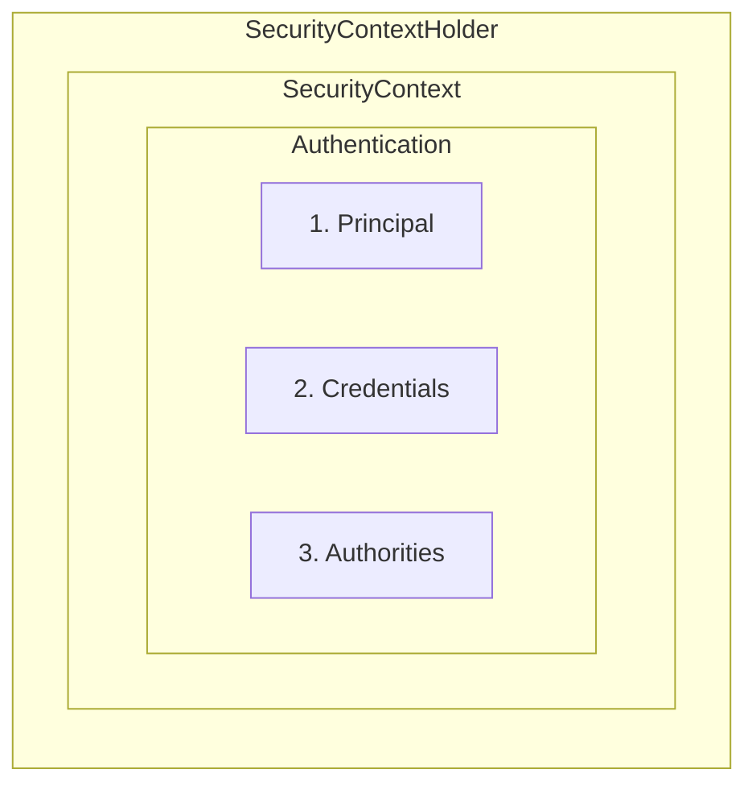

# The Big Picture

A larger view of what is happening in spring security. You'll learn about spring security filter chain, no of authentication components
that are common to working with spring security. 

## The filter chain

The spring security filter chain is a set of security filters that are run in a sequence on each request. 


Each filter can short-circuit the request and prevent the other filters 
and servlets from running. This carries some nice security benefits:
* Each filter can focus on its area of security expertise
* No filter needs to worry about downstream filters running if it rejects the request

Generally speaking, filter chain filters can be separated into 4 categories:
* [Defense filters](#defense-filters)
* [Authentication filters](#authentication-filters)
* [Authorization filters](#authorization-filters)
* [Infrastructural filters](#infrastructural-filters)

### Defense Filters
Before authentication is attempted, spring security defends the application against malicious requests. These filters include:

* **CSRFFilter** - the filter that checks incoming CSRF tokens and issues new ones
* **HeaderFilter** - the filter that writes secure headers to the HTTP response

Other than certain infrastructural filters, defence filters are the first filters in the filter chain

### Authentication filters

Once the request is determined to be safe, the filter chain moves on to the authenticating the request.

Each authentication filter handles a single authentication scheme. You'll already know a few.

* **BasicAuthenticationFilter** - Handles HTTP Basic authentication
* **BearerTokenAuthenticationFilter** - Handles Bearer token authentication (including JWTs)
* **UsernamePasswordAuthenticationFilter** - Handles Form login authentication
* **AnonymousAuthenticationFilter** - Populates the context with a Null Object authentication instance.

While not uniform, each authentication filter uses roughly the similar *pseudocode*

```java
// Note: this is pseudocode!
if (!requestMatcher.matches(request)) {
  // skip this filter
} else {
  Authentication token = getAuthenticationRequest(request) <1>
  try {
    Authentication result = authenticationManager.authenticate(token) <2> <3>
    saveToSecurityContextHolder(result);
    fireSuccessEvent(result);
    handleSuccess(result);
  } catch (AuthenticationException ex) {
    handleFailure(token);
  }
}

```
1. <1> parses the request material into a credential
2. <2> tests the credential and returns a principal and authorities
3. <3> constructs the principal and authorities

#### Authentication

`Authentication` is a spring security interface that represents both an authentication token and an authentication result.

Each authentication instance contains different values, depending upon whether it's a token or a result. 

| Authentication Token  | Authentication Result      |
|-----------------------|----------------------------|
| principal("who")      | principal("who")           |
| credential("proof")   | credential("proof")        |
| authenticated = false | authenticated = true       |
|                       | authorities("permissions") |

> **Note**: In some cases, like username and password authentication, the authentication result does not contain the user's password for security reasons.

As you can see in pseudo-code above:
* If the authentication fails, the *authenticationManager* throws an exception
* If the *authenticationManager* returns an *Authentication, then the authentication **Succeeded**

#### AuthenticationManager

`AuthenticationManager` is an interface that tests an authentication token. If the test succeeds, then the 
`AuthenticationManager` constructs an authentication result.

The `AuthenticationManager` is composed of several `AuthenticationProviders`, each of which handle a single authentication scheme, like authenticating a JWT. 

#### Security Context

The `SecurityContext` is an object that holds the current `Authentication`



The reason for `SecurityContext` is so that the application can hold additional security information other than the current user, if they want to;
However, this is the feature that is very rarely exercised in spring security. 

#### Reviewing Bearer JWT Authentication

So now let's look again at Bearer JWT Authentication, but this time in terms of the spring security authentication API. 

1. First, the `BearerTokenAuthenticationFilter` extracts the JWT into a `JwtAuthenticationToken` instance.
2. Then, it passes that authentication token to the `AuthenticationManager`. This `AuthenticationManager` holds a `JwtAuthenticationProvider` instance.
3. Next, `JwtAuthenticationProvider` authenticates the JWT and returns an authenticated instance of `JwtAuthenticationToken` that includes the parsed JWT and granted authorities.
4. Or, if the authentication fails, `JwtAuthenticationProvider` throws an `AuthenticationException`
5. Finally, the filter stores the authentication result in a `SecurityContext` instance for later use. 

### Authorization filters

Once the request is deemed both safe and authenticated, then the filter chain decides if the request is authorized. 
It does this in the `AuthenticationFilter`.

By default, Spring security constructs `AuthenticationFilter` that requires that all requests be authenticated. 
If the request is not authenticated then the filter rejects the request. 

This means, for ex:, that any request that contains a bearer token in `Authorization: Bearer `, spring security will
attempt to authenticate. This is true even when the endpoint is public, since even public endpoints may need to respond 
differently if there's an end user in the context. 

### The `SecurityFilterChain` Bean

The filter chain is represented by a single bean named `SecurityFilterChain`. It can hold an arbitrary number of security filters
that will execute on every request.

#### The Default Bean

The default one is set up for you that looks like this:

```java

@Bean
SecurityFilterChain securityFilterChain(HttpSecurity http) throws Exception {
    http
            .addFilter(webAsyncManagerIntegrationFilter) // infrastructure
            .securityContext(withDefaults()) // infrastructure
            .servletApi(withDefaults()) // infrastructure
            .csrf(withDefaults()) // defense
            .headers(withDefaults()) // defense
            .logout(withDefaults()) // authentication
            .sessionManagement(withDefaults()) // authentication
            .requestCache(withDefaults()) // authentication
            .formLogin(withDefaults()) // authentication
            .httpBasic(withDefaults()) // authentication
            .anonymous(withDefaults()) // authentication
            .exceptionHandling(withDefaults()) // infrastructure
            .authorizeHttpRequests((authorize) -> authorize  // authorization
                    .anyRequest().authenticated()
            );

    return http.build();
}

```
That's a lot of default security. 

Most of these are set for you in a prototype bean that spring security manages. Some of them are 
specified separately by spring boot. Because those defaults are set, when you ask for a reference to `HttpSecurity`, 
you typically only need to specify your authentication and authorization rules like so:

```java

@Bean
SecurityFilterChain securityFilterChain(HttpSecurity http) throws Exception {
    http
        .httpBasic(withDefaults()) // authentication
        .authorizeHttpRequests((authorize) -> authorize  // authorization
            .anyRequest().authenticated()
        );

    return http.build();
}

```

In the above snippet, all of spring security's defence and infrastructural defaults are still in place; 
you only need to specify authentication(`httpBasic`) and authorization(`authorizeHttpRequests`).

### The Default OAuth 2.0 Resource Server Bean

Since our Cash Card application is an OAuth 2.0 Resource Server, it should instead declare
`oAuth2ResourceServer` for authentication instead of `httpBasic`, like this:

```java
@Bean
SecurityFilterChain securityFilterChain(HttpSecurity http) throws Exception {
    http
        .oauth2ResourceServer((oauth2) -> oauth2  // authentication
            .jwt(withDefaults())
        )
        .authorizeHttpRequests((authorize) -> authorize  // authorization
            .anyRequest().authenticated()
        );

    return http.build();
}

```
While not strictly necessary, you can see that the `HttpSecurity` object is there to help simplify construction
of the filter chain. 

> Since the filter chain bean describes both authentication and authorization, it's important to remember that when you declare this bean, you must specify both. 
> In other words, this overrides whatever default `SecurityFilterChain` bean Boot provides based on your application properties. 

### So, when Haven't we seen this before?

This seems like a pretty important component, right?

It is; it's core of the spring security configuration and nearly every application has one declared.

In the earlier code, we did not add this configuration, but still the application worked as expected. 

That's because the Spring bott publishes a default `SecurityFilterChain` bean if your app doesn't declare one of its own.

**Ex: **

`spring-security-oauth2-resource-server` dependency and the `spring.security.oauth2.resourceserver.jwt.issuer-uri`
property, spring boot automatically published the default OAuth 2.0 resource server bean in the above code snippet. 

This way, the application is secure by default, but still open for extension as needed.

<- [Home](README.md)


